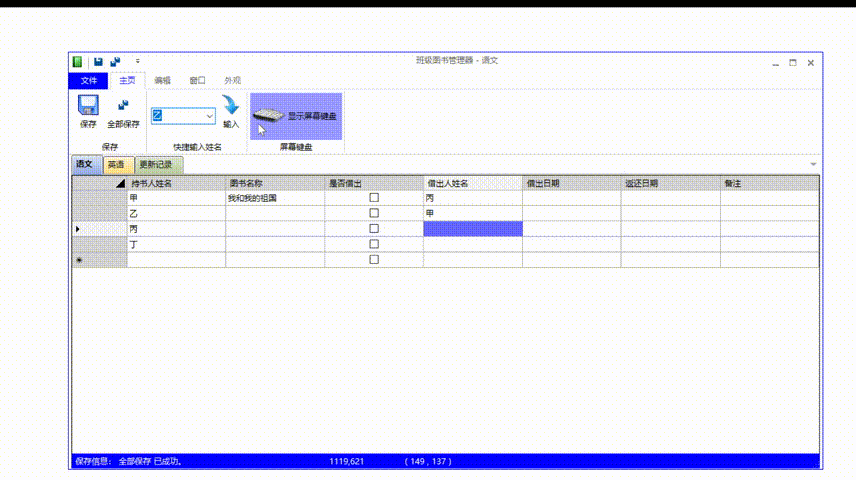

# Class Book Controller

A tool to manage book borrowing.

> (LC) LogCreative 2015 - 2016
> 
> [Log Infinity Project](https://github.com/LogCreative/LogInfinity) Memory Box

You can get the release version of this program in [Release Page](https://github.com/LogCreative/ClassBookController/releases). Initial password is **0000**.

## Objective

- This program uses UI template of **DotNetBar 12.0** to make a ribbon style menu.
- This program shows a way to **operate databases** (connect, edit, update) in Visual Basic .NET.

## Compilation

This redist version fixes some bugs to make the saving process working correctly.

To compile this program, you need to install `DotNetBar 12.0` from DevComponents, which contains many useful controls to make the interface more flatten with modern ribbon style.

> I won't provide the download link here because it's not a free plugin.

Then, open the `.sln` file. It's optional to open this project with 100% scaling for the plugin's compatibility. Just compile it.

To recompile the program, I fixed a 4-year-old bug **which causes the database unsavable**. It's also the reason for abadoning it long time ago when transfering data to use it in the second classroom. (Of cause, there's also a reason that the borrowing book activity was suspended when the schoolwork becomes much more heavier.)

The details are as follows:
- Modified the `.sfx` file, enable `Update()` function in ADVANCED OPTIONS. (which requires a key in the datatable.)
- Changed the code of the table to make the database is saved to the corresponding original file.
- Changed the connection string to fit in the age where the `Jet` was disposed and everyone use `ACE` as an alternative (Microsoft Office Access Software required).
- Only compile the solution without running the compiled program followed in Visual Studio. **Just run the compiled file in the Explorer.** Regenerating the project will refresh the database from all over again and the debugger will not detect any mofication you made from the previous running.
- I tried to clean auxilary bindings, but I failed due to the messy file structure left at that naive age. Just don't mess around with that, otherwise you may probably cannot open the designer file with some really confusing errors.

## Copyright

(LC) Log Creative 2015-2016

MIT License

This overrides all "ALL RIGHT RESERVED" claims in all source code with this README file appended.